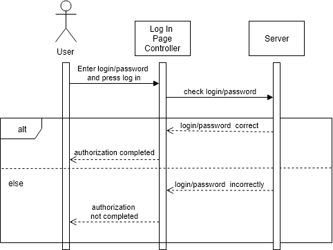
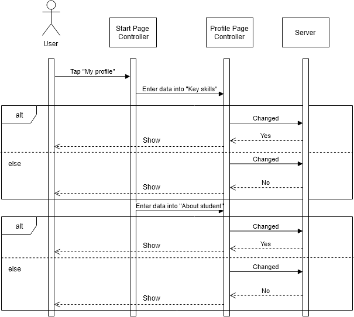
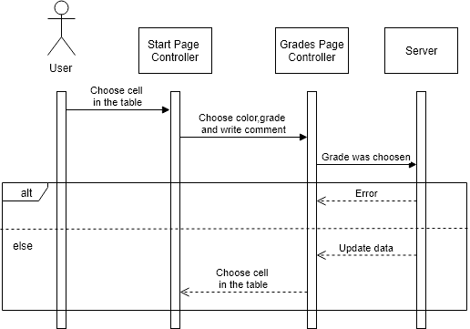

# Диаграммы активностей
---

# Содержание
1 [Вход в систему](#login)  
2 [Профиль](#profile) 
3 [Поиск](#search)
4 [Таблица преподавателей](#teachers)  
5 [Таблица Студентов](#student)

<a name="login"/>

# 1 Вход в систему
  

<a name="profile"/>

# 2 Профиль
  

<a name="search"/>

# 3 Поиск
  

<a name="teachers"/>

# 4 Таблица преподавателей
  

<a name="student"/>

# 5 Таблица студентов
  
