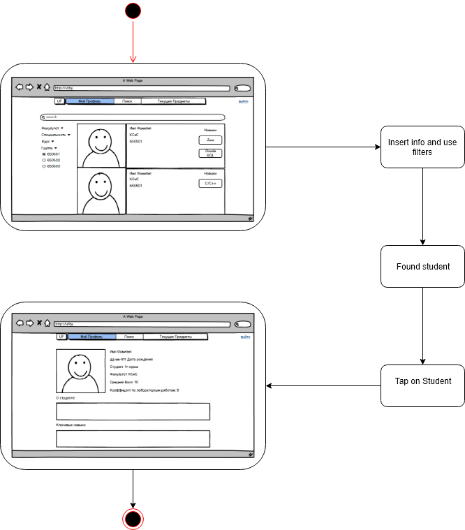

# Диаграммы состояния
---

# Содержание
1 [Вход в систему](#login)  
2 [Предметы](#objects)  
3 [Поиск](#search)  
4 [Таблица Студентов](#student)

<a name="login"/>

# 1 Вход в систему
  

<a name="objects"/>

# 2 Предметы
  

<a name="search"/>

# 3 Поиск
  

<a name="student"/>

# 4 Таблица
  
