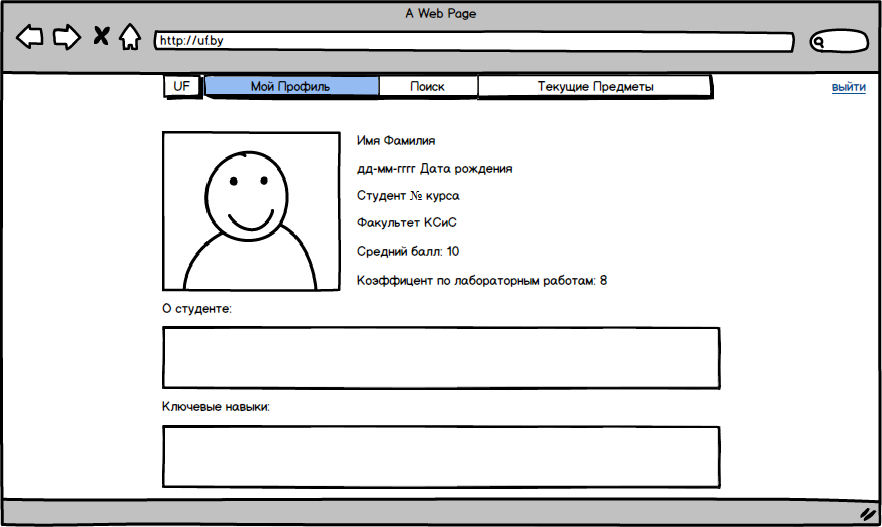
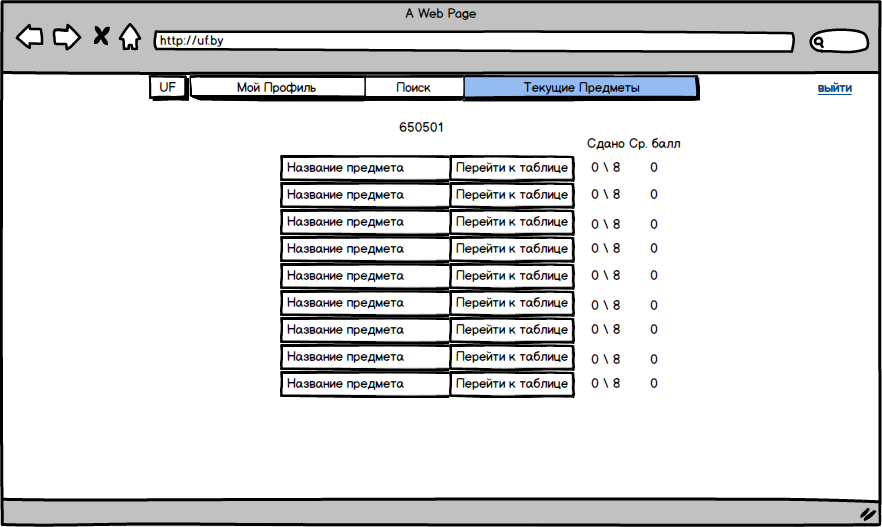

# Требования к проекту
---
# Содержание

# 1 Введение

## 1.1 Назначение

 В этом документе описаны функциональные и нефункциональные требования к Web-приложению “University Facemash”. Этот документ предназначен для команды, которая будет реализовывать и проверять корректность работы приложения.

## 1.2 Бизнес-требования

### 1.2.1 Исходные данные

В современном мире много людей работает с различного рода вычислениями.Однако, не все калькуляторы имеют возможность выполнять логические операции. Это приводит к тому, что пользователи ищут сторонние сервисы для получение желаемого результата. 

### 1.2.2 Возможности бизне

Многие студенты и преподователи желают иметь возможностб иметь систему для лёгкого взаимодействия между собой.
Подобное Web-приложение позволит преподавателям проще контролировать упеваемость студентов, упростить систему выдачи лабораторных работ минуя 'кучи' Google-дисков и прочих атрибутов современного обучения))).
Студентам будет проще узнать задание для лаботраторной работы,а так же оценнки выставленные им. 

## 1.3 Аналоги

?????

## Требования пользователя

### Программные интерфейсы

#####  Позволяет студентам:
- Входить и выходить из своей учётной записи
- Изменять свой пароль, если он был забыт
- Оставлять комментарий под своей оценкой, фидбеком или лабороторной работой
- Просматривать профили студентов, преподователей и своей группы, их статистики и контакты

##### Позволяет преподавателям:
 - Входить и выходить из своей учётной записи
 - Изменять свой пароль, если он был забыт
 - Поиск групп, студентов или преподователей, использую поисковую систему
 - Ставить оценки и оставлять комментарии к работам студентов
 - Отслеживать успеваемость студентов
 - Просматривать профили студентов, коллег и групп, их статистики и контакты
 - Должна быть возможность вычисления логических операций.
 
### Интерфейс пользователя

- Страница авторизации Web-приложения  
 

- Страницп таблицы с оценками  
 
  
 - Персональная страница 
 

 - Таблица с предметами студента
 

 - Таблица с предметами и группами преподавателя 
 

 - Страница поиска 
 

### Характеристики пользователей

### 2.3.1 Аудитория приложения

#### 2.3.1.1 Целевая аудитори

Преподаватели и студенты различных учебных заведений.

#### 2.3.1.2 Побочная аудитория

Родители контролирующие своих детей.

# 3 Системные требования

## 3.1 Функциональные требования

### 3.1.1 Основные функции
1.Вход и выход из учётной запии.
2.Изменение пароля.
3.Комментировать оценку, лабораторную работу.
4.Просмотривать профили студентов и преподавателей.

## 3.2 Нефункциональные требования

### 3.2.1 Атрибуты качества

#### 3.2.1.1 Требования к удобству использования
1. Все элементы должны быть светлыми;
2. Все функциональные элементы пользовательского интерфейса имеют названия, описывающие действие, которое произойдет при выборе элемента;

### 3.2.2 Внешние интерфейсы
Странициы Web-приложения удобны для использования пользователями с плохим зрением :
  * размер шрифта не менее 14пт;
  * функциональные элементы контрастны фону страницы.

### 3.2.3 Ограничения
1. ?????.
